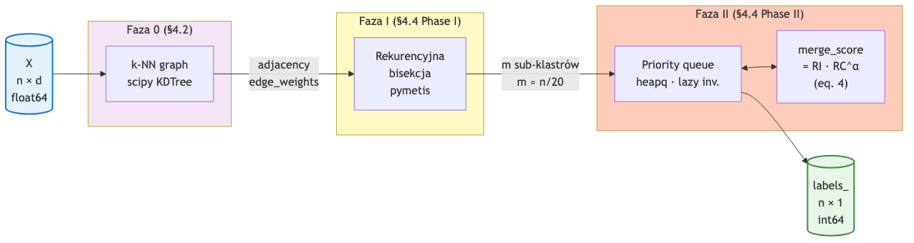

# 2. Algorytm CHAMELEON

## 2.1. Idea ogólna

CHAMELEON jest dwuetapowym algorytmem klasteryzacji hierarchicznej. Zamiast operować
bezpośrednio na surowych odległościach między punktami (jak k-means czy linkage), CHAMELEON
buduje **graf k-najbliższych sąsiadów** i prowadzi cały proces klasteryzacji jako operacje
na tym grafie. Dzięki temu uzyskuje:

- **odporność na różne gęstości**: krawędzie w grafie k-NN łączą każdy punkt z jego
  najbliższymi sąsiadami niezależnie od gęstości lokalnej,
- **odporność na niewypukłe kształty**: graf k-NN naturalnie podąża za strukturą zbioru,
- **modelowanie wewnętrznej struktury klastra**: po wstępnej fragmentacji grafu na małe
  podgrafy, każdy z nich ma już zdefiniowaną własną gęstość i interconnectivity.

## 2.2. Schemat dwufazowy



Dane wejściowe `X` (macierz `n × d`) przechodzą przez trzy etapy: budowę grafu
k-najbliższych sąsiadów, rekurencyjną bisekcję (Faza I) oraz aglomeracyjne łączenie
sub-klastrów (Faza II). Wynikiem jest wektor `labels_` o długości `n` przechowujący
identyfikator klastra dla każdego punktu.

## 2.3. Faza 0: budowa grafu k-najbliższych sąsiadów (§4.2)

**Cel:** zbudować rzadki graf `G = (V, E, w)`, gdzie:

- `V = {1, …, n}` — wierzchołki odpowiadają punktom,
- `(i, j) ∈ E` <=> `j` jest jednym z *k* najbliższych sąsiadów `i` (lub odwrotnie),
- `w(i, j) = 1 / d(xᵢ, xⱼ)` — waga krawędzi jest **odwrotnością odległości**
  (większa waga = większe podobieństwo).

**Parametr:** `k_nn` (typowo 5–20). Większe `k_nn` → gęstszy graf → lepsze
"przeskakiwanie" przerw między klastrami, ale większy koszt obliczeń.

**Implementacja:** `scipy.spatial.KDTree.query(X, k=k_nn+1)` w czasie `O(n log n)`
(pierwszy "sąsiad" to sam punkt, więc bierzemy k+1 i odrzucamy).

**Reprezentacja w pamięci:** lista list (CSR-like adjacency) — szczegóły w rozdz. 4.

## 2.4. Faza I: rekurencyjna bisekcja (§4.4 Phase I)

**Cel:** podzielić graf k-NN na `m` zwartych sub-klastrów, na których będzie operować
faza aglomeracyjna. Sub-klastry są **wstępną granulacją** danych.

**Algorytm (pseudokod z paperu Karypis 1999):**

```
function PHASE_I(graph G, min_cluster_size MS):
    sub_clusters ← {V(G)}            # początkowo jeden klaster ze wszystkimi wierzchołkami
    while ∃ C ∈ sub_clusters: |C| > MS:
        C ← largest cluster in sub_clusters
        (A, B) ← min_cut_bisect(G[C])  # pymetis: 2-way partition minimizing edge cut
        sub_clusters ← (sub_clusters \ {C}) ∪ {A, B}
    return sub_clusters
```

**Implementacja:** wywołanie `pymetis.part_graph(2, …)` w trybie `objtype='cut'`,
`ufactor=250` (paper rekomenduje ufactor=250, czyli ±25% rozmiarów partycji).

**Parametr:** `min_cluster_size` (oznaczony w paperu jako MinSize lub MS). Typowo
2.5% rozmiaru zbioru (`min_cluster_size = 0.025 · n`). Mniejszy MinSize → więcej
sub-klastrów → drobniejsza granulacja, więcej kandydatów do łączenia w fazie II.

**Złożoność:** `O(m · pymetis_bisect)`, gdzie pymetis ~ `O(|E| + |V| log |V|)`
multilevel METIS (Karypis & Kumar 1998).

## 2.5. Faza II: aglomeracyjne łączenie (§4.4 Phase II)

**Cel:** iteracyjnie łączyć pary sub-klastrów o najwyższym `merge_score` aż do
osiągnięcia żądanej liczby klastrów `n_clusters` (lub wyczerpania pozytywnych
kandydatów do łączenia).

**Algorytm (pseudokod):**

```
function PHASE_II(graph G, sub_clusters, target_k k, alpha α):
    queue ← priority_queue()
    for each pair (Cᵢ, Cⱼ) of sub-clusters connected in G:
        score ← RI(Cᵢ, Cⱼ) · RC(Cᵢ, Cⱼ)^α
        if score > 0:
            queue.push((-score, Cᵢ, Cⱼ))   # heapq: minus dla max-heap

    while |sub_clusters| > k and queue.not_empty():
        (-score, Cᵢ, Cⱼ) ← queue.pop()
        if Cᵢ or Cⱼ already merged: continue   # lazy invalidation
        Cₘ ← merge(Cᵢ, Cⱼ)
        update queue with neighbors of Cₘ

    return sub_clusters
```

**Parametr:** `alpha` (α). Eksponent w `merge_score = RI · RCᵅ` (eq. 4 w paperu):

- `α > 1` — preferowane łączenia o wysokim **RC** (zachowanie spójności gęstości),
- `α < 1` — preferowane łączenia o wysokim **RI** (zachowanie sieci połączeń),
- `α = 2.0` — wartość domyślna z paperu, dobrze sprawdza się na większości zbiorów.

## 2.6. Miary podobieństwa międzyklastrowego

Niech `EC_{Cᵢ,Cⱼ}` oznacza zbiór krawędzi grafu k-NN łączących wierzchołki klastra
`Cᵢ` z wierzchołkami klastra `Cⱼ`. Niech `EC_Cᵢ` oznacza krawędzie **bisektora**
klastra `Cᵢ` — czyli zbiór krawędzi, które trzeba usunąć aby podzielić `Cᵢ` na
dwie zbliżone rozmiarem części (uzyskany przez `pymetis.part_graph(2, …)` na
podgrafie indukowanym przez `Cᵢ`).

### 2.6.1. Relative Interconnectivity — RI (eq. 1)

$$
RI(C_i, C_j) \;=\; \frac{\bigl|EC_{\{C_i, C_j\}}\bigr|}{\tfrac{1}{2}\bigl(|EC_{C_i}| + |EC_{C_j}|\bigr)}
$$

**Interpretacja:** stosunek **sumarycznej wagi krawędzi krzyżujących granicę** `Cᵢ-Cⱼ`
do **średniej wewnętrznej interconnectivity** obu klastrów. Wartość `RI ≈ 1`
oznacza, że łączenie nie osłabi struktury żadnego klastra.

### 2.6.2. Relative Closeness — RC (eq. 2)

$$
RC(C_i, C_j) \;=\; \frac{\bar{S}_{EC_{\{C_i, C_j\}}}}{\frac{|C_i|}{|C_i|+|C_j|} \cdot \bar{S}_{EC_{C_i}} \;+\; \frac{|C_j|}{|C_i|+|C_j|} \cdot \bar{S}_{EC_{C_j}}}
$$

gdzie $\bar{S}_E$ oznacza **średnią wagę** krawędzi w zbiorze $E$.

**Interpretacja:** stosunek **średniej gęstości połączeń granicznych** do
**ważonej średniej wewnętrznej gęstości** obu klastrów. Waga jest proporcjonalna
do rozmiaru klastra — większy klaster bardziej wpływa na "globalną" gęstość.

### 2.6.3. Merge score (eq. 4)

$$
\text{score}(C_i, C_j) \;=\; RI(C_i, C_j) \cdot RC(C_i, C_j)^{\alpha}
$$

To główne kryterium decyzyjne fazy II. Para `(Cᵢ, Cⱼ)` o najwyższym `score`
zostaje połączona jako pierwsza.

### 2.6.4. Wyznaczenie EC_Cᵢ

`EC_Cᵢ` (interconnectivity wewnętrzna klastra) wymaga **bisekcji** podgrafu
klastra `Cᵢ`. Implementacja używa tej samej funkcji `pymetis.part_graph(2, …)`
co Faza I. Wartość `|EC_Cᵢ|` jest **cache'owana** po pierwszym wyznaczeniu —
nie zmienia się dopóki klaster nie zostanie scalony z innym.

## 2.7. Parametry algorytmu — podsumowanie

| Parametr            | Symbol w paperu | Domyślnie | Wpływ                                           |
|---------------------|-----------------|-----------|-------------------------------------------------|
| `n_clusters`        | *k*             | 8         | docelowa liczba klastrów                        |
| `k_nn`              | *knn*           | 10        | liczba sąsiadów w grafie k-NN                   |
| `min_cluster_size`  | *MS* / *MinSize*| 0.025·n   | minimalny rozmiar sub-klastra w fazie I         |
| `alpha`             | *α*             | 2.0       | eksponent RC w merge_score                      |

## 2.8. Charakterystyka algorytmu

**Zalety:**

- jakość — wykrywanie klastrów o **różnych kształtach, rozmiarach i gęstościach** (sekcja 5
  paperu Karypis 1999 demonstruje to na DS1–DS5, gdzie k-means/CURE/DBSCAN zawodzą),
- elastyczność — graf k-NN można zbudować dla danych o dowolnej metryce odległości
  (nie tylko euklidesowej),
- generuje pełną hierarchię — można zatrzymać proces na dowolnej liczbie klastrów.

**Wady i ograniczenia:**

- wymaga ustawienia trzech parametrów (`k_nn`, `min_cluster_size`, `alpha`); wybór
  jest czuły zwłaszcza dla `k_nn`,
- pymetis nie jest deterministyczny — różne uruchomienia mogą dać minimalnie różne
  bisekcje (omawiane w rozdz. 5),
- naiwna budowa grafu k-NN to `O(n²)` — w naszej implementacji rozwiązane przez KDTree
  (`O(n log n)`), patrz rozdz. 5,
- KDTree zaprojektowany pod **niskie wymiary** (≤10D); dla danych wysokowymiarowych
  zalecamy zastąpienie przez Annoy lub HNSW w przyszłej wersji.
