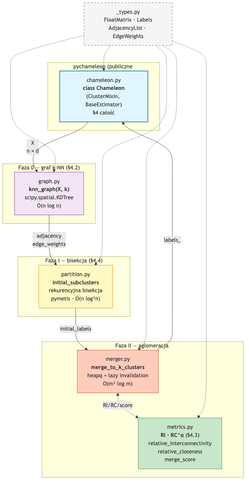

# 3. Opis implementacji

## 3.1. Architektura pakietu

Implementacja jest zorganizowana w **5 modułów**, każdy mapowany na konkretną sekcję paperu Karypisa 1999. Publiczne API to jedna klasa `Chameleon` zgodna z konwencją scikit-learn (`BaseEstimator + ClusterMixin`).

| Moduł              | Sekcja paperu  | Główne funkcje / klasy                                                | Złożoność        |
|--------------------|----------------|------------------------------------------------------------------------|------------------|
| `graph.py`         | §4.2           | `knn_graph(X, k) -> (adjacency, edge_weights)`                         | `O(n log n)`     |
| `partition.py`     | §4.4 Phase I   | `initial_subclusters(adj, weights, min_size) -> labels`                | `O(n log² n)`    |
| `metrics.py`       | §4.3           | `relative_interconnectivity`, `relative_closeness`, `merge_score`      | vectorised       |
| `merger.py`        | §4.4 Phase II  | `merge_to_k_clusters(adj, weights, init_labels, k, α) -> labels`       | `O(m² log m)`    |
| `chameleon.py`     | §4 całość      | `class Chameleon(ClusterMixin, BaseEstimator)`                         | orkiestracja     |

Pomocniczy `_types.py` dostarcza aliasów (`FloatMatrix`, `Labels`, `AdjacencyList`, `EdgeWeights`).

## 3.2. Przepływ danych

Wywołanie `Chameleon().fit(X)` wykonuje sekwencyjnie:

1. **Faza 0** (`graph.knn_graph`): `scipy.spatial.cKDTree.query(X, k+1)` zwraca k najbliższych sąsiadów; budujemy symetryczny graf rzadki z wagami `1/dist`. Złożoność `O(n log n)` zamiast `O(n²)` w implementacji referencyjnej Moonpuck.
2. **Faza I** (`partition.initial_subclusters`): rekurencyjna bisekcja 2-way min-cut przez `pymetis.part_graph` aż każdy sub-klaster ma rozmiar ≤ `min_cluster_size`. Dodatkowy krok: dekompozycja na spójne komponenty przed bisekcją (METIS daje degenerowane cięcia na niespójnych grafach).
3. **Faza II** (`merger.merge_to_k_clusters`): kolejka priorytetowa (`heapq`) z parami sąsiadujących sub-klastrów kluczowanymi przez `merge_score = RI · RC^α`. Lazy invalidation eliminuje rebuild `O(m²)` po każdym scaleniu.

## 3.3. Struktury danych

| Struktura                       | Reprezentacja                                | Po co tak                                  |
|---------------------------------|----------------------------------------------|--------------------------------------------|
| Wejście                         | `np.ndarray` shape `(n, d)`, dtype float64   | konwencja sklearn, walidacja `_validate_data` |
| Graf k-NN — sąsiedzi            | `list[NDArray[int64]]`                       | direct pymetis CSR compatibility           |
| Graf k-NN — wagi                | `list[NDArray[float64]]`                     | równoległa indeksacja z adjacency          |
| Etykiety klastrów               | `NDArray[int64]` shape `(n,)`                | maski boolean, sklearn convention          |
| Kolejka priorytetowa (Faza II)  | `heapq` z `(-score, ver_i, ver_j, ci, cj)`   | `O(log m)` push/pop + lazy invalidation    |
| Wersje klastrów                 | `dict[int, int]`                             | invalidacja przestarzałych wpisów heap'a   |
| Cache `\|EC_Cᵢ\|`               | `dict[frozenset[int], tuple[float, float]]`  | unikamy powtarzanych bisekcji pymetis      |

`pymetis.part_graph(2, xadj, adjncy, eweights)` wymaga formatu CSR z **całkowitymi** wagami; konwersja float→int przez kwantyzację `* 1_000_000` (4 miejsca po przecinku).

## 3.4. Decyzje projektowe

| Decyzja        | Wybór                    | Uzasadnienie                                                |
|----------------|--------------------------|-------------------------------------------------------------|
| k-NN backend   | `scipy.spatial.cKDTree`  | `O(n log n)` zamiast `O(n²)`; ~47× speedup dla n = 8000      |
| Bisekcja       | `pymetis.part_graph(2)`  | multilevel KL refinement — stan sztuki dla min-cutu          |
| Kolejka Faza II| `heapq` + lazy invalidation | amortyzowany `O(log m)` push/pop, eliminuje rebuild       |
| Graph repr.    | `list[ndarray]` adjacency | direct CSR compatibility; szybsze niż networkx               |
| API wejścia    | `X` (n × d, float64)     | konwencja sklearn; pipeline-compatible                       |
| Layout pakietu | src-layout (PEP 660)     | zapobiega bugom import-order; standard sklearn/numpy/scipy   |
| Build backend  | hatchling                | minimalny, nowoczesny `pyproject.toml`                       |
| Type checker   | `mypy --strict`          | standard sklearn-style libs; długoterminowa pielęgnowalność  |
| Linter         | `ruff`                   | 10× szybszy od pylint+flake8+isort razem                     |

## 3.5. Złożoność teoretyczna

Niech `n` — liczba punktów, `m ≈ n/20` — sub-klastrów po Fazie I, `k` — `k_nn`.

| Faza                       | pychameleon         | Moonpuck (ref.)      |
|----------------------------|---------------------|----------------------|
| Faza 0 — k-NN graph        | `O(n log n)` KDTree | `O(n²)` naiwna       |
| Faza I — bisekcja          | `O(n log² n)`       | `O(n log² n)`        |
| Faza II — aglomeracja      | `O(m² log m)` lazy  | `O(m³)` rebuild      |
| Pamięć                     | `O(nd + nk + m²)`   | `O(n²)`              |

Dominuje `O(n log² n)`. Walidacja empiryczna w rozdziale 6.4.

## 3.6. Testy — strategia 5-warstwowa

| Warstwa             | Cel                                              | Liczba / próg                        |
|---------------------|--------------------------------------------------|--------------------------------------|
| Jednostkowe         | Każdy moduł osobno; hand-computed wartości       | 36 testów (5 modułów)                |
| Integracyjne (e2e)  | `fit()` end-to-end                                | E2E na blobs + Aggregation           |
| sklearn-compat      | `check_estimator(Chameleon())`                   | ~30 sanity checks                    |
| Porównawcze         | Wyniki vs Moonpuck na 3 zbiorach                 | sekcja 6.2                           |
| Parametryczne       | Sweep `k_nn`, `α`, `min_cluster_size`             | sekcja 6.3                           |
| Skalowalności       | `n` vs runtime + `d` vs runtime                  | sekcja 6.4                           |

Pokrycie kodu: `pytest --cov=pychameleon` ≥ 90% linii. Pełna baza testów w `tests/`.
